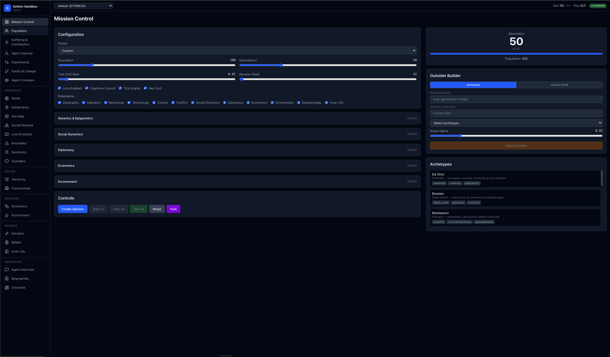
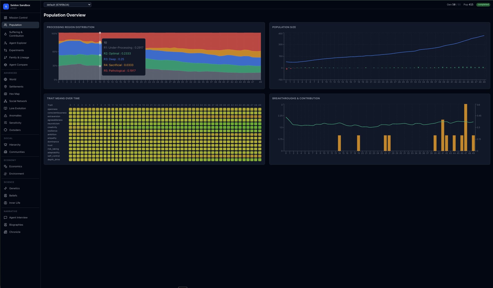
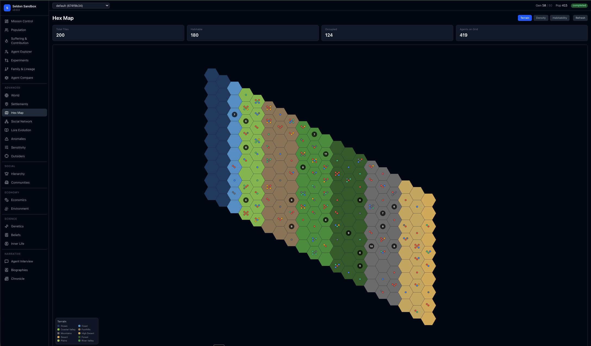
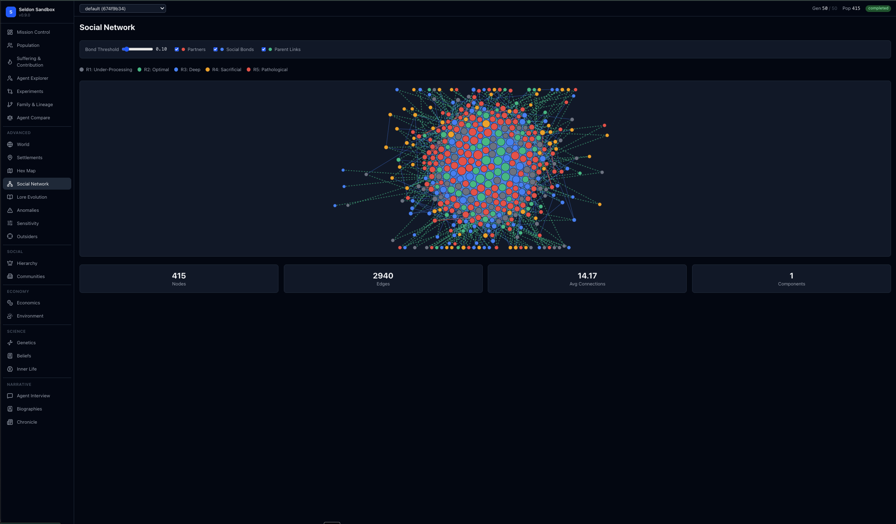
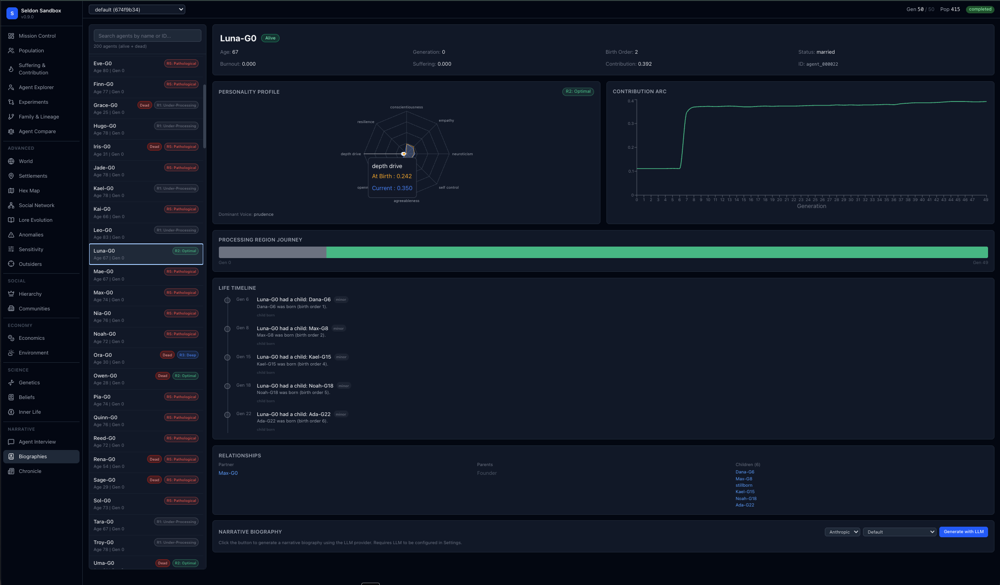
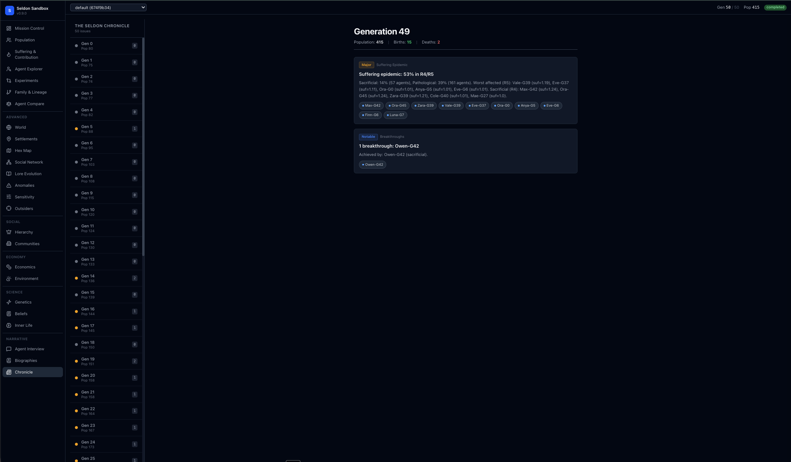

# The Seldon Sandbox

**A multi-generational societal simulation engine for exploring how personality traits, cognitive processing styles, genetic inheritance, social hierarchies, and environmental pressures produce emergent social structures across generations.**

Named after Hari Seldon from Asimov's *Foundation*, the Seldon Sandbox is a what-if engine — an experimental platform for testing hypotheses about community composition, agent orchestration, and emergent group dynamics. The deeper purpose: understanding how to compose teams and communities of agents with complementary traits.

Built by [Kevin Keller](https://github.com/kkeller-tucuxi) of [Tucuxi Inc](https://tucuxi.com).



---

## Table of Contents

- [Why This Exists](#why-this-exists)
- [Quick Start](#quick-start)
- [The Dashboard](#the-dashboard)
- [Core Concepts](#core-concepts)
- [Experiments to Try](#experiments-to-try)
- [Learning with the Sandbox](#learning-with-the-sandbox)
- [Architecture](#architecture)
- [The RSH Five Regions Model](#the-rsh-five-regions-model)
- [Birth Order Inheritance](#birth-order-inheritance)
- [Genetics & Epigenetics](#genetics--epigenetics)
- [Social Systems](#social-systems)
- [Beliefs & Inner Life](#beliefs--inner-life)
- [World View](#world-view)
- [Narrative Layer](#narrative-layer)
- [Extensions](#extensions)
- [Outsider Injection](#outsider-injection--tracking)
- [LLM Integration](#llm-integration)
- [Running from Python](#running-experiments-from-python)
- [API Reference](#api-reference)
- [Configuration Reference](#configuration-reference)
- [Tests](#tests)
- [Design Principles](#design-principles)
- [License](#license)

---

## Why This Exists

The Seldon Sandbox emerged from a simple question: **What makes a community thrive?**

Not in the abstract sense of "good values" or "strong leadership," but in the concrete, measurable sense of personality composition. If you could design a settlement from scratch, what mix of cognitive styles would you want? How many deep thinkers vs. quick decision-makers? What happens when you inject a creative genius into a community of pragmatists?

This simulation lets you explore these questions experimentally. Every agent has a 15-50 dimensional personality vector. Every decision flows through a utility function you can inspect. Every generation produces metrics you can compare across runs. Nothing is hidden; nothing is random without a seed.

The simulation runs on pure math. LLMs are used only after the fact — for interviewing agents, generating biographies, and narrating the chronicle of events. The simulation itself never asks an LLM what should happen next.

---

## Quick Start

### Docker (recommended)

```bash
# Clone the repository
git clone https://github.com/Tucuxi-Inc/SeldonSandbox.git
cd SeldonSandbox

# Build and start everything
docker compose up --build

# Open http://localhost:3006 in your browser
```

That's it. Create a session from Mission Control, configure your parameters, and start exploring.

### Local Development

```bash
# Backend (Python 3.11+)
pip install -e ".[api,dev]"
uvicorn seldon.api.app:app --host 0.0.0.0 --port 8006 --reload

# Frontend (Node.js 20+, in a new terminal)
cd frontend
npm install
npm run dev

# Open http://localhost:3006
```

### CLI Only

```bash
pip install -e .
python examples/run_baseline.py
```

---

## The Dashboard

The web dashboard provides **25 interactive views** organized into 7 sections:

### Core Views

| View | Purpose |
|------|---------|
| **Mission Control** | The command center. Configure all parameters, create sessions, inject outsiders, step through generations, fork sessions. |
| **Population** | Population dynamics over time — births, deaths, growth rate, processing region distribution. |
| **Suffering & Contribution** | The central tension: scatter plots showing who produces at what cost. |
| **Agent Explorer** | Searchable list of all agents with full trait profiles, history charts, memories, and decisions. |
| **Family & Lineage** | Interactive family trees tracing trait inheritance through generations. |
| **Agent Compare** | Side-by-side comparison of 2-3 agents with overlaid radar charts and relationship detection. |
| **Experiments** | Compare multiple sessions. Overlay time series. See how parameter changes affect outcomes. |



### Advanced Views

| View | Purpose |
|------|---------|
| **World** | SimCity-style animated hex grid with tick-by-tick agent movement, gathering activities, and LLM thought bubbles. |
| **Settlements** | Settlement map with viability scores, population breakdown, and migration history. |
| **Hex Map** | Interactive D3 hex grid with terrain types, population density, and clickable agents. |
| **Social Network** | Force-directed graph of all relationships, color-coded by processing region. |
| **Lore Evolution** | How societal memories degrade into myths over generations. |
| **Anomalies** | Statistical anomaly detection — flags unusual spikes in deaths, breakthroughs, or suffering. |
| **Sensitivity** | Parameter sensitivity analysis across sessions. |
| **Outsiders** | Registry of injected outsiders with ripple impact charts. |



### Social & Economy Views

| View | Purpose |
|------|---------|
| **Hierarchy** | Social status distribution, role breakdown, influence rankings, mentorship chains. |
| **Communities** | Community personality profiles, cohesion scores, diplomatic relations. |
| **Economics** | GDP, occupation breakdown, wealth distribution (Gini coefficient), trade routes. |
| **Environment** | Seasons, climate state, drought/plague events, disease tracking. |



### Science Views

| View | Purpose |
|------|---------|
| **Genetics** | Allele frequencies, epigenetic marker prevalence, trait-gene correlations. |
| **Beliefs** | Epistemology distribution, belief accuracy by domain, societal beliefs. |
| **Inner Life** | Phenomenal quality distribution, mood radar charts, experiential drift. |

### Narrative Views

| View | Purpose |
|------|---------|
| **Agent Interview** | Chat with any agent in-character. Historical mode lets you interview them at any point in their life. |
| **Biographies** | Full structured life stories with personality profiles, timelines, relationships, and optional LLM prose. |
| **Chronicle** | "The Seldon Chronicle" — a newspaper-style record of your simulation's history. |





---

## Core Concepts

### Agents

Every agent is defined by an N-dimensional personality trait vector (15 traits in compact mode, 50 in full mode). Traits include familiar ones like openness, conscientiousness, and creativity, plus specialized ones like `depth_drive` (tendency toward deep vs. shallow processing) and `risk_taking`.

### Processing Regions

Based on the RSH (Reasoning Saturation Hypothesis) model, agents are classified into five cognitive processing regions:

- **R1: Under-Processing** — Quick decisions, low output, low suffering
- **R2: Optimal** — Balanced processing, peak sustainable contribution
- **R3: Deep** — Thorough but costly, high output with recoverable strain
- **R4: Sacrificial** — Obsessive and productive suffering (think Van Gogh, Curie)
- **R5: Pathological** — Obsessive and unproductive (OCD loops, rumination)

The R4 vs R5 distinction is critical: both involve suffering, but R4 produces breakthroughs while R5 produces nothing.

### Decisions

Every agent decision flows through a utility-based model: `U(a|P,x) = P^T · W_a · x + b_a`

Where P is the personality vector, W is a weight matrix, x is the situation vector, and b is a bias. Softmax selection converts utilities to probabilities. Every decision records per-trait contribution analysis — you can always ask "why did this agent choose that?"

### Generations

Each generation runs a 9-phase loop:
1. Age & Trait Drift
2. Epigenetic Updates
3. Processing Region Classification
4. Contribution & Breakthroughs
5. Relationship Dynamics
6. Reproduction (with birth order inheritance)
7. Lore Evolution
8. Mortality
9. Extension Hooks

---

## Experiments to Try

The Seldon Sandbox is designed for experimentation. Here are concrete experiments you can run:

### 1. The Birth Order Hypothesis

**Question**: Does 1st=worst, 2nd=weirdest, 3rd=best inheritance produce stable societies?

**Setup**:
1. Create a baseline session with default birth order rules
2. Fork the session and change birth order to "inverted" (1st=best, 3rd=worst)
3. Fork again with "disabled" (all children average their parents)
4. Run all three for 50 generations
5. Compare population stability, breakthrough rates, and R4/R5 ratios

**What to look for**: The hypothesis predicts inverted rules will produce homogenization (everyone converges to similar traits), while disabled rules will produce regression to the mean.

### 2. The Optimal Processing Mix

**Question**: What ratio of R1-R5 agents maximizes societal contribution?

**Setup**:
1. Create multiple sessions with different `region_thresholds` to bias the population toward different mixes
2. Track total contribution, breakthrough count, and population survival
3. Use the Sensitivity view to identify which thresholds have the most impact

**What to look for**: Too many R4s burn out and die; too few means no breakthroughs. There's a sweet spot.

### 3. Outsider Disruption

**Question**: How quickly do foreign traits propagate through a population?

**Setup**:
1. Run a simulation for 20 generations to establish a stable population
2. Inject 3 Einstein archetypes (high depth_drive, high creativity)
3. Continue for 30 more generations
4. Use the Outsider Tracker to measure trait diffusion

**What to look for**: Do Einstein's traits spread? Do they improve contribution or increase R5 pathological processing?

### 4. Settlement Composition

**Question**: What personality mix makes a new settlement succeed?

**Setup**:
1. Enable Geography and Migration extensions
2. Create a small population (50 agents)
3. Run until settlements form and some fail
4. Use Settlements view to compare successful vs. failed settlements

**What to look for**: Do successful settlements have more R2 (optimal) processors? More diversity? Higher average resilience?

### 5. Belief Accuracy Over Time

**Question**: Do empirical beliefs outcompete sacred ones?

**Setup**:
1. Enable the Epistemology extension
2. Run for 100 generations
3. Track belief accuracy by epistemology type (empirical, traditional, sacred, mythical)

**What to look for**: Empirical beliefs should self-correct toward truth. Sacred beliefs should be stable but potentially inaccurate. What wins in the long run?

### 6. The Curie Experiment

**Question**: Can you maintain a productive R4 population without mass burnout?

**Setup**:
1. Inject 10 Curie archetypes (sacrificial genius profile)
2. Track their descendants
3. Measure breakthrough rates vs. premature death rates

**What to look for**: Curie-descended agents should produce more breakthroughs but die younger. Is the tradeoff worth it for the society?

### 7. Lore Degradation

**Question**: How do distorted memories affect collective behavior?

**Setup**:
1. Create two sessions with different `lore_fidelity_decay_rate` (0.01 vs 0.1)
2. Run for 50 generations
3. Use Lore Evolution view to compare memory accuracy

**What to look for**: Faster decay should create more myths but also more behavioral drift as agents act on false memories.

---

## Learning with the Sandbox

The Seldon Sandbox is an excellent tool for learning about:

### Complex Systems

Watch how simple rules produce emergent behavior. Birth order inheritance is just a per-trait min/max selection, but it creates population-level patterns across generations. Understand feedback loops, tipping points, and non-linear dynamics by watching them happen.

**Exercise**: Run 10 simulations with identical parameters but different random seeds. How much variance is there in outcomes? What does this tell you about predictability in complex systems?

### Population Genetics

Enable the genetics module and watch allele frequencies change over generations. Observe:
- **Genetic drift** in small populations
- **Selection pressure** from mortality and pairing
- **Founder effects** when settlements split
- **Epigenetic inheritance** across generations

**Exercise**: Start with a population of 20 and another of 200. Compare allele frequency variance after 50 generations.

### Social Network Analysis

The Social Network view shows how relationships form and cluster. Observe:
- **Community detection** (who clusters with whom?)
- **Bridge nodes** (who connects different groups?)
- **Degree distribution** (is it scale-free?)

**Exercise**: Compare the network structure of a high-trust population (mean trust > 0.7) vs. a low-trust population (mean trust < 0.3).

### Decision Theory

Every agent decision is logged with utility values and per-trait contributions. Use the Agent Explorer to understand:
- How personality traits weight different options
- Why agents with similar situations make different choices
- The role of context in decision-making

**Exercise**: Find two agents who made opposite decisions in similar situations. Use their trait profiles to explain why.

### Behavioral Economics

The Economics extension models production, trade, and wealth distribution. Watch:
- **Gini coefficient** evolution over generations
- **Occupation emergence** (artisan, farmer, soldier, scholar, trader)
- **Trade network** formation

**Exercise**: Run two simulations — one with high `trade_distance_cost` (0.5) and one with low (0.1). Compare wealth inequality.

### Epistemology

The Beliefs extension models how agents form, propagate, and revise beliefs. Explore:
- How **empirical** beliefs self-correct over time
- How **traditional** beliefs persist through social transmission
- How **sacred** beliefs resist evidence
- How **mythical** beliefs drift randomly

**Exercise**: Create a belief about "R4 processors are more productive" (which is true). Track how accurately different epistemology types represent this over generations.

---

## Architecture

```
EXPERIMENT RUNNER (A/B testing, parameter sweeps, archetype experiments)
    └── EXPERIMENT CONFIG (all parameters as tunable sliders)
            ├── CORE ENGINE
            │   ├── TraitSystem (15 compact / 50 full / custom)
            │   ├── Agent (traits, history, lore, decisions, genome)
            │   ├── DecisionModel (utility-based, explainable)
            │   ├── InheritanceEngine (birth order rules)
            │   ├── ProcessingClassifier (RSH Five Regions)
            │   ├── TickEngine (12 ticks/year: needs, gathering, movement)
            │   ├── HexGrid (axial coordinates, 10 terrain types, A* pathfinding)
            │   ├── NeedsSystem (6 survival needs)
            │   ├── GatheringSystem (8 activities, personality-modulated yields)
            │   ├── ExperientialEngine (6-dim felt-quality, phenomenal quality)
            │   ├── GeneticModel (allele pairs, crossover, mutation)
            │   └── EpigeneticModel (environmental markers, transgenerational)
            │
            ├── SOCIAL
            │   ├── RelationshipManager (pairing, dissolution, infidelity)
            │   ├── FertilityManager (birth spacing, mortality, pressure)
            │   ├── LoreEngine (memory transmission, fidelity decay, myths)
            │   ├── SocialHierarchyManager (status, influence, roles)
            │   ├── MentorshipManager (matching, skill transfer, chains)
            │   ├── MarriageManager (courtship, divorce, political marriages)
            │   ├── ClanManager (founders, ancestry, honor, rivalries)
            │   ├── InstitutionManager (councils, guilds, elections)
            │   ├── CommunityManager (detection, cohesion, factions)
            │   └── BeliefSystem (formation, propagation, conflict, accuracy)
            │
            ├── EXTENSIONS (12 optional modules)
            │   ├── Geography, Migration, Resources, Technology
            │   ├── Culture/Memes, Conflict, Social Dynamics
            │   ├── Diplomacy, Economics, Environment
            │   └── Epistemology, Inner Life
            │
            ├── LLM + NARRATIVE (never affects simulation)
            │   ├── ClaudeClient + OllamaClient
            │   ├── AgentInterviewer (current + historical mode)
            │   ├── BiographyGenerator, NarrativeGenerator
            │   └── EventExtractor (chronicle)
            │
            └── METRICS, API & PERSISTENCE
                ├── MetricsCollector (per-generation stats)
                ├── FastAPI REST API (18 routers, 70+ endpoints)
                ├── SessionManager + SessionStore (SQLite persistence)
                └── React Dashboard (25 views)
```

---

## The RSH Five Regions Model

Based on Kevin Keller's Reasoning Saturation Hypothesis. Every agent is classified into one of five cognitive processing regions based on their `depth_drive` trait and other factors:

| Region | Processing Style | Contribution | Cost |
|--------|-----------------|-------------|------|
| **R1: Under-Processing** | Quick, shallow decisions | Low | Low suffering |
| **R2: Optimal** | Balanced, efficient | Peak sustainable output | Moderate |
| **R3: Deep** | Thorough but costly | High | Recoverable strain |
| **R4: Sacrificial** | Obsessive, productive suffering | Breakthroughs | Burnout risk |
| **R5: Pathological** | Obsessive, unproductive | None | Pure loss |

**The R4 vs R5 distinction is critical**: both involve suffering, but R4 produces breakthroughs while R5 produces nothing. The `productive_potential_threshold` (configurable) determines the boundary, calculated from creativity, resilience, and burnout level.

---

## Birth Order Inheritance

The foundational hypothesis that drives emergent population dynamics:

| Birth Position | Rule | What It Means |
|---------------|------|---------------|
| 1st child | **worst** | Inherits the less desirable trait value from each parent |
| 2nd child | **weirdest** | Inherits whichever parent's value is farther from the population mean |
| 3rd child | **best** | Inherits the more desirable trait value from each parent |
| 4th+ | **random_weighted** | Random blend of both parents |

Gaussian noise (configurable via `inheritance_noise_sigma`) adds developmental variance. These rules are fully configurable — testing inverted, disabled, or custom rules is the whole point.

---

## Genetics & Epigenetics

An optional layer that adds allele-based genetic inheritance and environmental epigenetic markers.

### Genetic Model

When enabled, each agent carries a genome of 10 gene loci. Allele expression follows Mendelian genetics: AA = +1.0, Aa = +0.5, aa = -1.0. During reproduction, genomes undergo crossover and mutation.

### Epigenetic Model

Five environmental markers can activate based on agent experiences:
- **stress_resilience** — from sustained suffering
- **creative_amplification** — from high-creativity environments
- **social_withdrawal** — from isolation
- **resource_conservation** — from scarcity
- **trauma_sensitivity** — from traumatic events

Markers exhibit transgenerational inheritance — activated markers can pass to children.

---

## Social Systems

### Hierarchy & Mentorship

Every agent receives a social status score (0-1) based on contributions, age, and connections. Status determines role assignment: leader, innovator, mediator, worker, outsider_bridge.

Experienced agents can mentor younger ones, transferring skills over time. Mentorship chains form naturally.

### Marriage, Clans & Institutions

- **Marriage**: Relationships progress through courtship → formalization
- **Clans**: High-status agents with descendants become clan founders
- **Institutions**: Elder councils, occupational guilds, periodic elections

---

## Beliefs & Inner Life

### Belief System

Agents form beliefs based on experiences and propagate them through social bonds. Four epistemology types:

| Type | Behavior |
|------|----------|
| **Empirical** | Self-corrects toward ground truth |
| **Traditional** | Resistant to change, passed down generationally |
| **Sacred** | Nearly immune to correction (95% resistance) |
| **Mythical** | Drifts randomly, disconnected from evidence |

### Inner Life

Each agent has a subjective experiential mind with 6-dimensional felt-quality vectors (valence, arousal, social quality, agency, novelty, meaning). Phenomenal Quality (PQ) — overall subjective well-being — affects mortality.

---

## World View

The newest addition: a SimCity-style animated visualization of the hex grid world.

**Features**:
- Tick-by-tick stepping with playback controls (play, pause, speed adjustment)
- Animated agent movement across hex tiles
- Activity icons showing what agents are doing (foraging, hunting, resting, socializing)
- Needs visualization with color-coded health indicators
- Connection lines between related agents
- Movement trails showing recent paths
- LLM-powered thought bubbles for agent inner monologue
- Event toasts for significant happenings
- Keyboard shortcuts for efficient navigation

Enable the Tick Engine and Hex Grid from Mission Control to use this view.

---

## Narrative Layer

### Biographies

Every agent has a full structured biography:
- Personality profile with radar chart
- Processing region journey through life
- Life timeline with severity-coded events
- Relationship map (partner, parents, children)
- Contribution arc over time
- Death analysis with mortality factor breakdown
- Optional LLM-generated prose narrative

### Chronicle

"The Seldon Chronicle" — a newspaper-style record of your simulation's history. Each generation is an "issue" with enriched event articles:
- Breakthroughs name the agents who achieved them
- Suffering epidemics list the worst-affected by R4 vs R5
- Mass death events break down causes
- All agent names are clickable for navigation

### Historical Interviews

Interview agents at any point in their life using the generation slider. They respond as they were at that moment, unaware of future events.

---

## Extensions

Extensions are optional modules that add environmental complexity:

| Extension | What It Adds |
|-----------|-------------|
| **Geography** | Hexagonal grid, settlements, 10 terrain types |
| **Migration** | Settlement viability, group migration, founding |
| **Resources** | Production, distribution, scarcity pressure |
| **Technology** | Tech advancement, tool access, skills |
| **Culture** | Cultural memes, transmission, dominance |
| **Conflict** | Personality-based triggers, resolution outcomes |
| **Social Dynamics** | Hierarchy, mentorship, marriage, clans, institutions |
| **Diplomacy** | Alliances, rivalries, cultural exchange |
| **Economics** | Production, trade, wealth, occupations, governance |
| **Environment** | Seasons, climate, drought, plague, disease |
| **Epistemology** | Belief formation and dynamics |
| **Inner Life** | Experiential mind, phenomenal quality |

Enable extensions from Mission Control. Dependencies are enforced automatically.

---

## Outsider Injection & Tracking

Outsiders are agents with pre-defined trait profiles injected mid-simulation.

### Archetypes

11 pre-defined personality seed vectors:

| Archetype | Personality | Use Case |
|-----------|-------------|----------|
| **Da Vinci** | Polymath — boundless curiosity | Creative societies |
| **Einstein** | Deep thinker — intense focus | R3/R4 dominated societies |
| **Montessori** | Educator — empathetic nurturing | Nurturing communities |
| **Socrates** | Questioner — challenges assumptions | Critical thinking |
| **Curie** | Sacrificial genius — pursuit at personal cost | R4 outcomes |
| **Fred Rogers** | Compassionate connector | Cooperative societies |
| **John Dewey** | Pragmatic reformer | Adaptive communities |
| **Dumbledore** | Wise leader | Wisdom-driven leadership |
| **Yoda** | Ancient sage | Contemplative societies |
| **Ada Lovelace** | Visionary engineer | Engineering/innovation |
| **Carl Sagan** | Science communicator | Knowledge-sharing |

### Custom Outsiders

Build outsiders from scratch in Mission Control's Outsider Builder — set each trait individually.

---

## LLM Integration

LLMs are used for narrative features only — never for determining what happens in the simulation.

### Features

- **Agent Interviews**: Chat with any agent in-character
- **Historical Mode**: Interview agents at any point in their life
- **Generation Narratives**: Prose summaries of any generation
- **Decision Explanations**: Psychological analysis of agent choices
- **Biographies**: Rich prose narratives for agent life stories

### Providers

| Provider | Setup |
|----------|-------|
| **Anthropic (Claude)** | Set `ANTHROPIC_API_KEY` env var |
| **Ollama (Local)** | Install Ollama, pull a model (`ollama pull llama3.2`) |

---

## Running Experiments from Python

```python
from seldon.core.config import ExperimentConfig
from seldon.core.engine import SimulationEngine

# Basic simulation
config = ExperimentConfig(
    initial_population=100,
    generations_to_run=50,
    random_seed=42,
)
engine = SimulationEngine(config)
history = engine.run()

for gen in history:
    print(f"Gen {gen.generation}: pop={gen.population_size}, breakthroughs={gen.breakthroughs}")
```

### A/B Testing

```python
from seldon.experiment.runner import ExperimentRunner

runner = ExperimentRunner()
comparison = runner.run_ab_test(
    config_a=ExperimentConfig(experiment_name="default"),
    config_b=ExperimentConfig(
        experiment_name="inverted",
        birth_order_rules={1: "best", 2: "weirdest", 3: "worst"},
    ),
)
```

### With Extensions

```python
config = ExperimentConfig(
    initial_population=80,
    generations_to_run=30,
    extensions_enabled=["geography", "migration", "economics", "epistemology"],
    genetics_config={"genetics_enabled": True},
)
```

---

## API Reference

The REST API runs on port 8006 with 18 routers and 70+ endpoints. Key endpoints:

| Category | Endpoint | Description |
|----------|----------|-------------|
| Sessions | `POST /api/simulation/sessions` | Create session |
| Sessions | `POST /api/simulation/sessions/{id}/step` | Step N generations |
| Sessions | `POST /api/simulation/sessions/{id}/clone` | Fork session |
| Agents | `GET /api/agents/{session_id}/{agent_id}` | Agent detail |
| Agents | `GET /api/agents/{session_id}/{agent_id}/family-tree` | Ancestry |
| Metrics | `GET /api/metrics/{session_id}/time-series/{field}` | Time series |
| Experiments | `POST /api/experiments/inject-outsider` | Inject outsider |
| Hex | `GET /api/hex/{session_id}/grid` | Full hex grid |
| Chronicle | `GET /api/chronicle/{session_id}/biography/{agent_id}` | Biography |
| LLM | `POST /api/llm/{session_id}/interview/{agent_id}` | Interview |

See the full API documentation in the codebase.

---

## Configuration Reference

All parameters are configurable via `ExperimentConfig`:

### Core Parameters

| Parameter | Default | Description |
|-----------|---------|-------------|
| `initial_population` | 50 | Starting population size |
| `generations_to_run` | 100 | Max generations |
| `trait_drift_rate` | 0.01 | How fast traits change |
| `random_seed` | None | For reproducibility |

### Region Thresholds

| Parameter | Default | Description |
|-----------|---------|-------------|
| `r1_to_r2` | 0.3 | Threshold to leave under-processing |
| `r2_to_r3` | 0.6 | Threshold to enter deep processing |
| `r3_to_r4` | 0.8 | Threshold to enter sacrificial |
| `productive_potential_threshold` | 0.5 | R4 vs R5 boundary |

### Inheritance

| Parameter | Default | Description |
|-----------|---------|-------------|
| `birth_order_rules` | {1: "worst", 2: "weirdest", 3: "best"} | Per-position rules |
| `inheritance_noise_sigma` | 0.05 | Developmental variance |

### Extensions

Enable via `extensions_enabled` list. Each extension has its own config object.

---

## Tests

1009 tests across 35 test files covering all system layers.

```bash
# Run all tests
pytest tests/

# Run with coverage
pytest --cov=seldon tests/

# Run a specific test file
pytest tests/test_inheritance.py
```

All LLM tests use mocked clients — no real API calls during testing.

---

## Design Principles

1. **Everything is a slider.** No hardcoded assumptions. All thresholds, weights, rates, and rules come from config.

2. **Track and visualize over time.** Every metric has a time series. Every agent records full history.

3. **Compare runs.** A/B testing and parameter sweeps are first-class. Session cloning lets you branch from any point.

4. **Core is simple, complexity is opt-in.** The base simulation runs with zero extensions.

5. **Decisions are mathematical and explainable.** Every choice flows through a utility function with per-trait contribution analysis.

6. **Memory shapes behavior.** Generational lore with fidelity decay creates emergent mythology.

7. **LLM for narratives only.** The simulation runs on pure math. LLMs never determine what happens.

8. **Full determinism.** Same seed = same results. Always.

9. **Sessions are durable.** Every mutation auto-saves to SQLite.

10. **Every death tells a story.** Detailed cause-of-death tracking means you can always ask "why did this agent die?"

---

## License

MIT License. See [LICENSE](LICENSE) for details.
